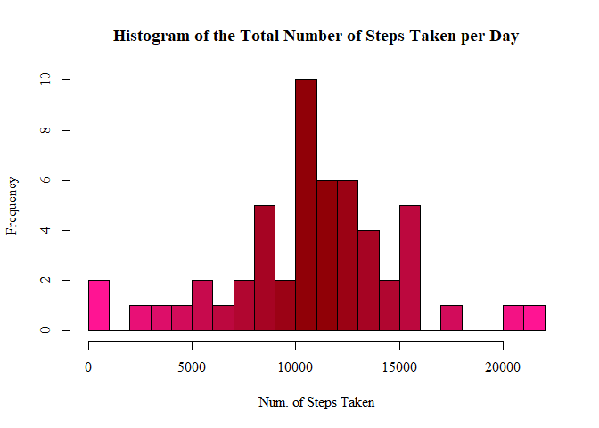
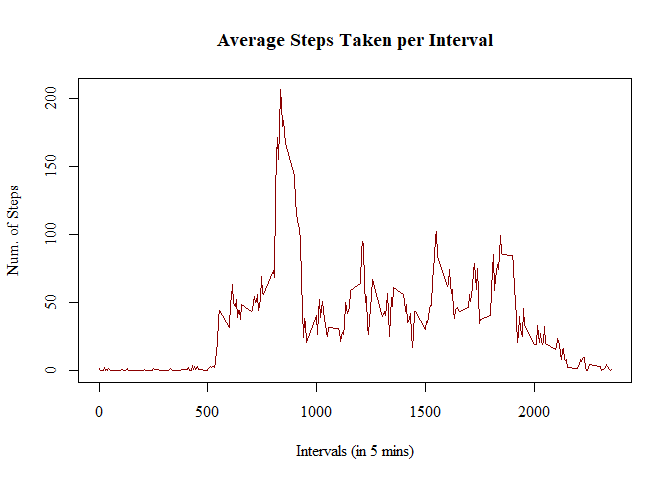
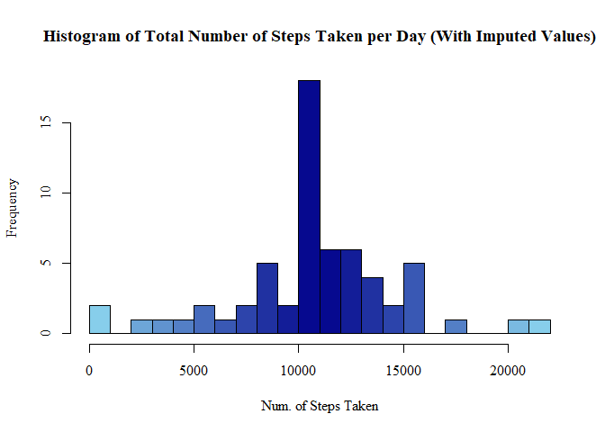
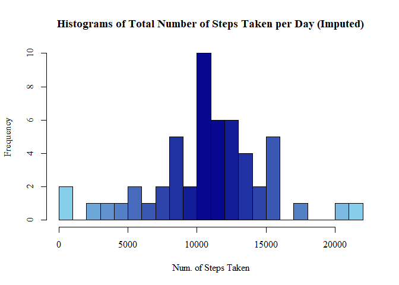
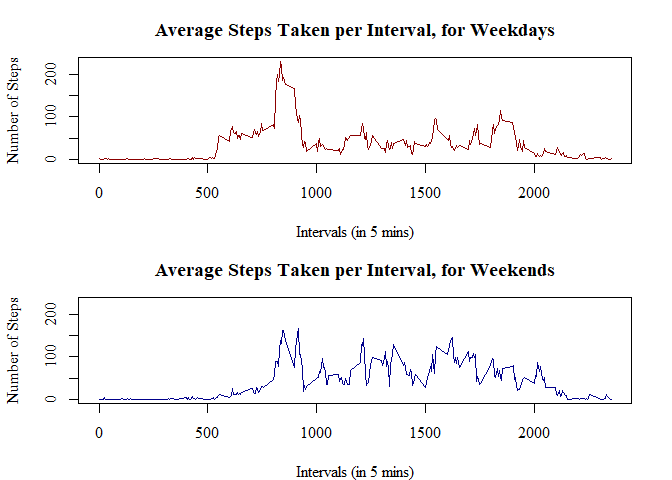

## Reproducible Research-1

## Mehmet Simsek

### Question 1: Libraries and Data

```r
library(ggplot2)
library(dplyr)
```

```
## 
## Attaching package: 'dplyr'
```

```
## The following objects are masked from 'package:stats':
## 
##     filter, lag
```

```
## The following objects are masked from 'package:base':
## 
##     intersect, setdiff, setequal, union
```

```r
Sys.setlocale("LC_TIME", "English")
```

```
## [1] "English_United States.1252"
```

```r
Data <- read.csv("activity.csv", colClasses=c("numeric", "Date", "numeric"))
```


### Question 2: What is mean total number of steps taken per day?

```r
data <- Data[!(is.na(Data$steps)), ]

totalSteps <- aggregate(steps ~ date, data, sum)
```


```r
paletteRed <- colorRampPalette(c("deeppink", "darkred", "deeppink"))
hist(totalSteps$steps, breaks=25, xlab="Num. of Steps Taken", 
     main="Histogram of the Total Number of Steps Taken per Day",
     col=paletteRed(22), family="serif")
```

<!-- -->

```r
total_num_steps <- summarise(totalSteps, meanOfTotalSteps=mean(totalSteps$steps),
                               medianOfTotalSteps=median(totalSteps$steps))
print(total_num_steps)
```

```
##   meanOfTotalSteps medianOfTotalSteps
## 1         10766.19              10765
```


### Question 3: What is the average daily activity pattern?

```r
meanInterval <- aggregate(steps ~ interval, data, mean)
```


```r
plot(x=meanInterval$interval, y=meanInterval$steps, type="l",
     main="Average Steps Taken per Interval",
     ylab="Num. of Steps", xlab="Intervals (in 5 mins)",
     col="darkred", lwd=1.5, family="serif")
```

<!-- -->


### Question 4: Imputation

```r
imputedData <- Data
for(x in 1:17568) {
  if(is.na(Data[x, 1])==TRUE) {
    imputedData[x, 1] <- meanInterval[meanInterval$interval %in% imputedData[x, 3], 2]
  }
}


imputedTotalStep <- aggregate(steps ~ date, imputedData, sum)
```


```r
paletteBlue <- colorRampPalette(c("skyblue", "darkblue", "skyblue"))
hist(imputedTotalStep$steps, breaks=20, xlab="Num. of Steps Taken", 
     main="Histogram of Total Number of Steps Taken per Day (With Imputed Values)",
     col=paletteBlue(22), family="serif")
```

<!-- -->

```r
meanOfTotalSteps=mean(imputedTotalStep$steps)
print(meanOfTotalSteps)
```

```
## [1] 10766.19
```

```r
medianOfTotalSteps=median(imputedTotalStep$steps)
print(medianOfTotalSteps)
```

```
## [1] 10766.19
```


```r
paletteBlue <- colorRampPalette(c("skyblue", "darkblue", "skyblue"))
hist(totalSteps$steps, breaks=25, xlab="Num. of Steps Taken", 
     main="Histograms of Total Number of Steps Taken per Day (Imputed)",
     col=paletteBlue(22), family="serif")
```

<!-- -->

### Question 5: Are there differences in activity patterns between weekdays and weekends?

```r
daysData <- imputedData
daysData$days <- weekdays(daysData$date)
daysData$weekday <- as.character(rep(0, times=17568))
for(x in 1:17568) {
  if(daysData[x, 4] %in% c("Saturday", "Sunday")) {
    daysData[x, 5] <- "weekend"
  } else {
    daysData[x, 5] <- "weekday"
  }
}
daysData$weekday <- factor(daysData$weekday)


weekday <- daysData[daysData$weekday=="weekday", ]
weekend <- daysData[daysData$weekday=="weekend", ]

weekdayMean <- aggregate(steps ~ interval, weekday, mean)
```


```r
weekendMean <- aggregate(steps ~ interval, weekend, mean)
```


```r
par(mfrow=c(2, 1), mar=c(4, 4.1, 3, 2.1))
plot(weekdayMean$interval, weekdayMean$steps, type="l",
     main="Average Steps Taken per Interval, for Weekdays",
     xlab="Intervals (in 5 mins)", ylab="Number of Steps", family="serif",
     col="darkred", lwd=1.5, ylim=c(0, 230))
plot(weekendMean$interval, weekendMean$steps, type="l",
     main="Average Steps Taken per Interval, for Weekends",
     xlab="Intervals (in 5 mins)", ylab="Number of Steps", family="serif",
     col="darkblue", lwd=1.5, ylim=c(0, 230))
```

<!-- -->


